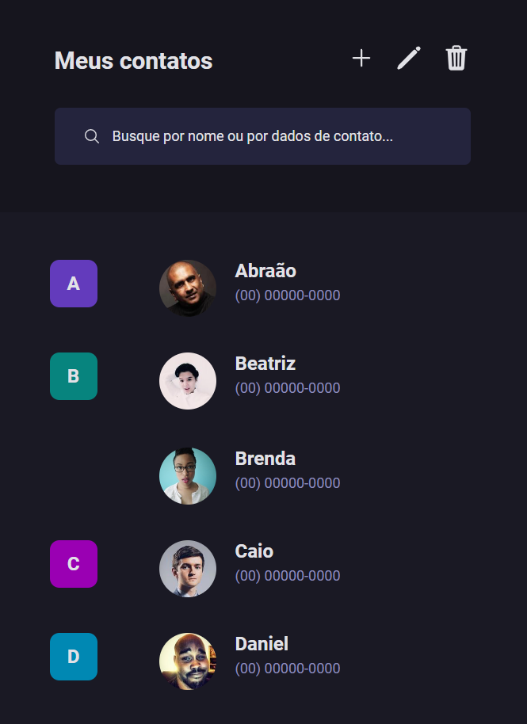

<h1 align="center"> Página de Contatos </h1>

A Página de Contato é uma aplicação simples e funcional que permite aos usuários filtrar contatos diretamente na página.

  <a href="#-tecnologias">Tecnologias</a>&nbsp;&nbsp;&nbsp;|&nbsp;&nbsp;&nbsp;
  <a href="#-projeto">Projeto</a>&nbsp;&nbsp;&nbsp;|&nbsp;&nbsp;&nbsp;
  <a href="#-destaques do aprendizado">Destaques do Aprendizado</a>&nbsp;&nbsp;&nbsp;|&nbsp;&nbsp;&nbsp;
  <a href="#memo-licença">Licença</a>&nbsp;&nbsp;&nbsp;|&nbsp;&nbsp;&nbsp;
 

 

  

## 🚀 Tecnologias

Esse projeto foi desenvolvido com as seguintes tecnologias:

- HTML e CSS
- JavaScript
- Git e Github
- Figma.

## 💻 Projeto

A Página de Contato é uma aplicação simples e funcional que permite aos usuários filtrar contatos diretamente na página. Este projeto me ajudou a reforçar conceitos importantes e aprender novas técnicas.

- [Acesse o projeto finalizado, online](https://juandasilvaa.github.io/Pagina-de-Contatos/)

## 🔍 Destaques do Aprendizado

- Barra de navegação: Criação e estilização.
- Filtro de elementos na DOM com JavaScript PURO: Implementação de um sistema de busca para filtrar contatos.

## 📝 Licença

Este projeto faz parte do #boraCodar da Rocketseat, onde eles fornecem um design no Figma e você deve desenvolver. Para acessar a resolução da forma deles, é necessário ser assinante., [clique aqui](https://www.rocketseat.com.br/boracodar/desafios-anteriores/uma-pagina-de-contatos-desafio-16).
